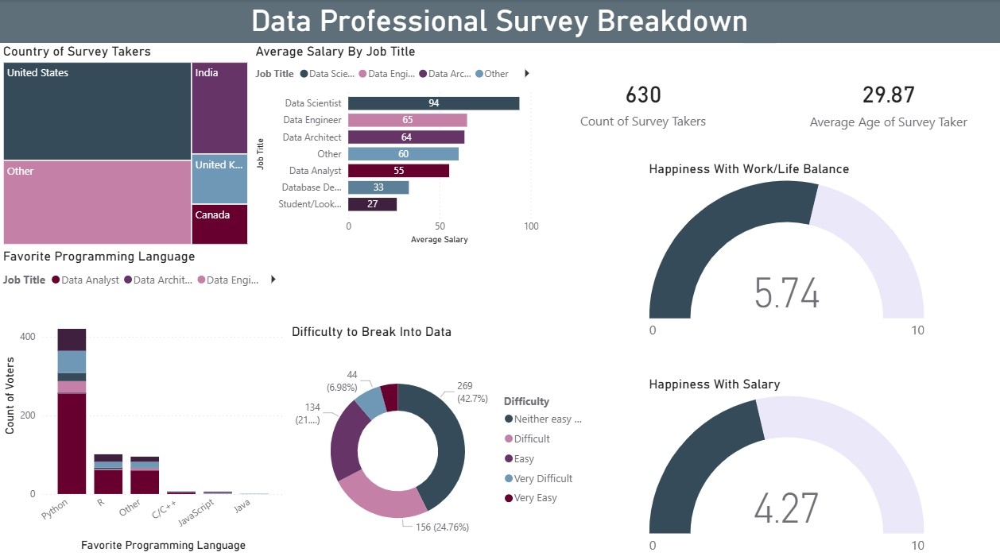

Data Professional Survey Analysis – Power BI Dashboard   

Project Overview:  
This project analyzes a survey of 630 data professionals to understand salary trends, popular programming languages, career difficulty, and job satisfaction across different roles and countries. The dashboard provides interactive insights for exploring the data industry landscape.   

Dashboard Preview:  
  

Key Features:  

1. Interactive Power BI dashboard analyzing survey data of data professionals. 
2. Visual breakdown of average salary by job role (Data Scientist, Data Engineer, Data Analyst, etc.). 
3. Country-wise analysis of survey participants. 
4. Comparison of favorite programming languages among data professionals. 
5. Insights into career entry difficulty in the data field. 
6. Visualization of work-life balance satisfaction and salary satisfaction.  

Dashboard Insights:  

1. Data Scientists have the highest average salary (~94k), followed by Data Engineers (~65k) and Data Architects (~64k). 
2. Python is the most preferred programming language among data professionals. 
3. A large portion of respondents believe breaking into data roles is moderately difficult. 
4. Average work-life balance satisfaction score: 5.74 / 10. 
5. Average salary satisfaction score: 4.27 / 10. 
6. Majority of survey participants are from United States and India.  

Tools & Technologies:  

- Power BI  
- Data Visualization  
- Data Cleaning  
- Interactive Dashboard Design  
- Survey Data Analysis   

Dashboard Components:  

1. Country Distribution (Tree Map)  
2. Average Salary by Job Title (Bar Chart)  
3. Favorite Programming Language (Stacked Column Chart)  
4. Difficulty to Break Into Data (Donut Chart)  
5. Work-Life Balance Gauge  
6. Salary Satisfaction Gauge  
7. Survey Demographics Metrics (Count & Average Age)   

Purpose of the Project:  

The purpose of this project is to analyze trends in the data profession and demonstrate Power BI dashboard development skills using real-world survey data.

Connect With Me:  

LinkedIn: https://www.linkedin.com/in/afzal-rangrej/   

Thank You.
  
